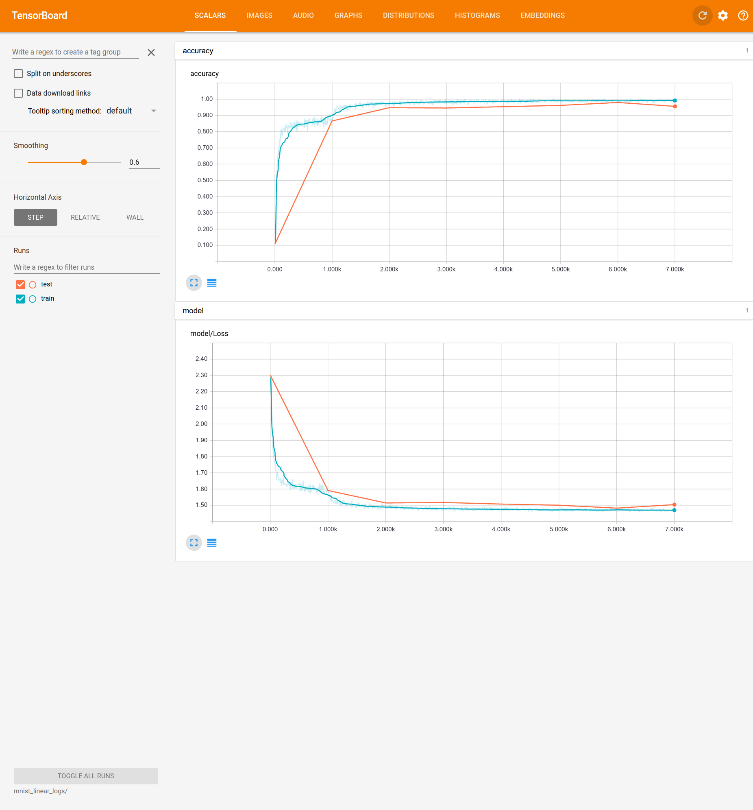
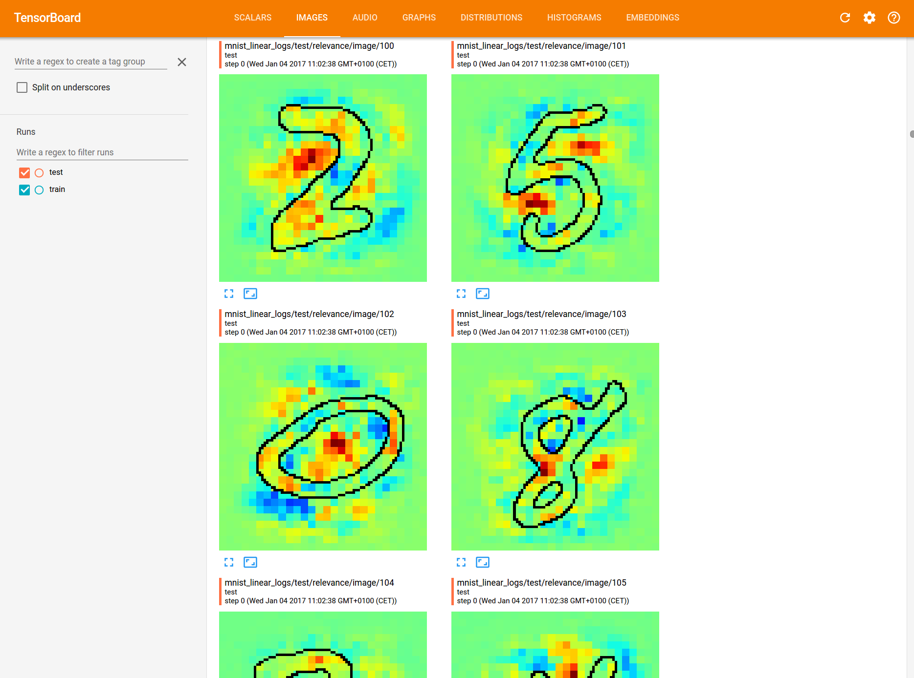
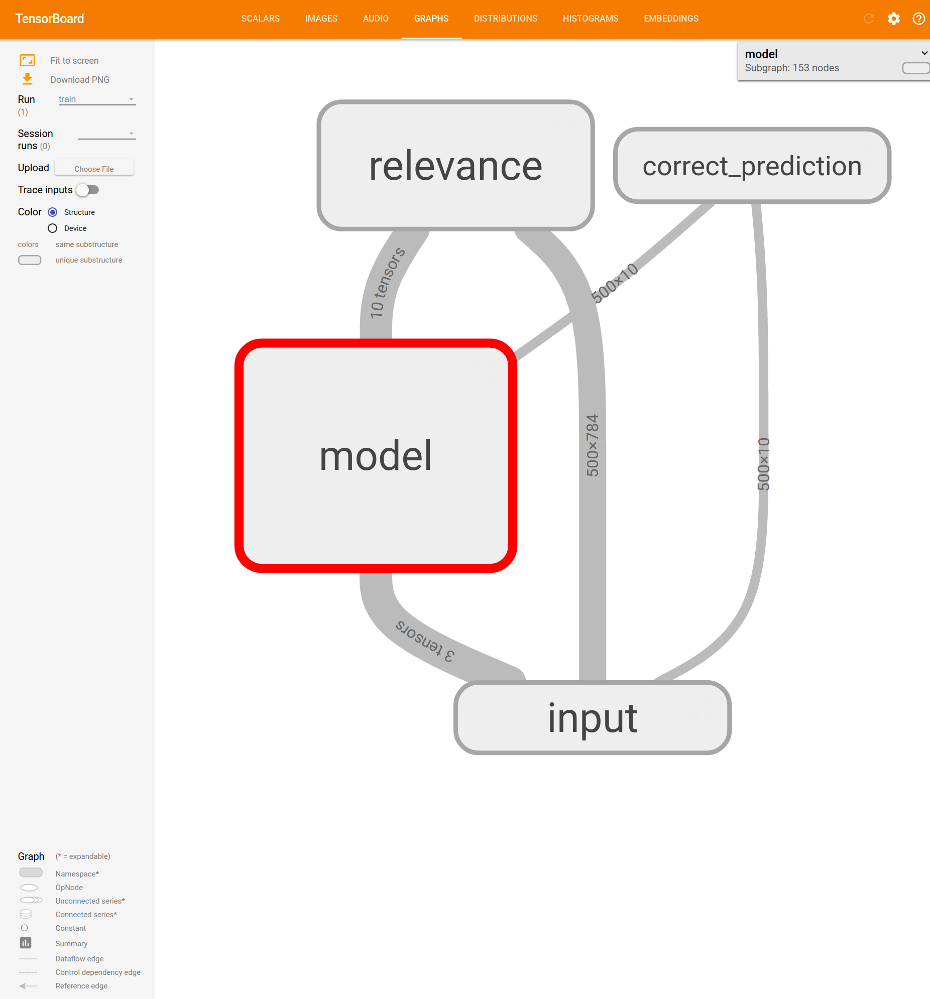
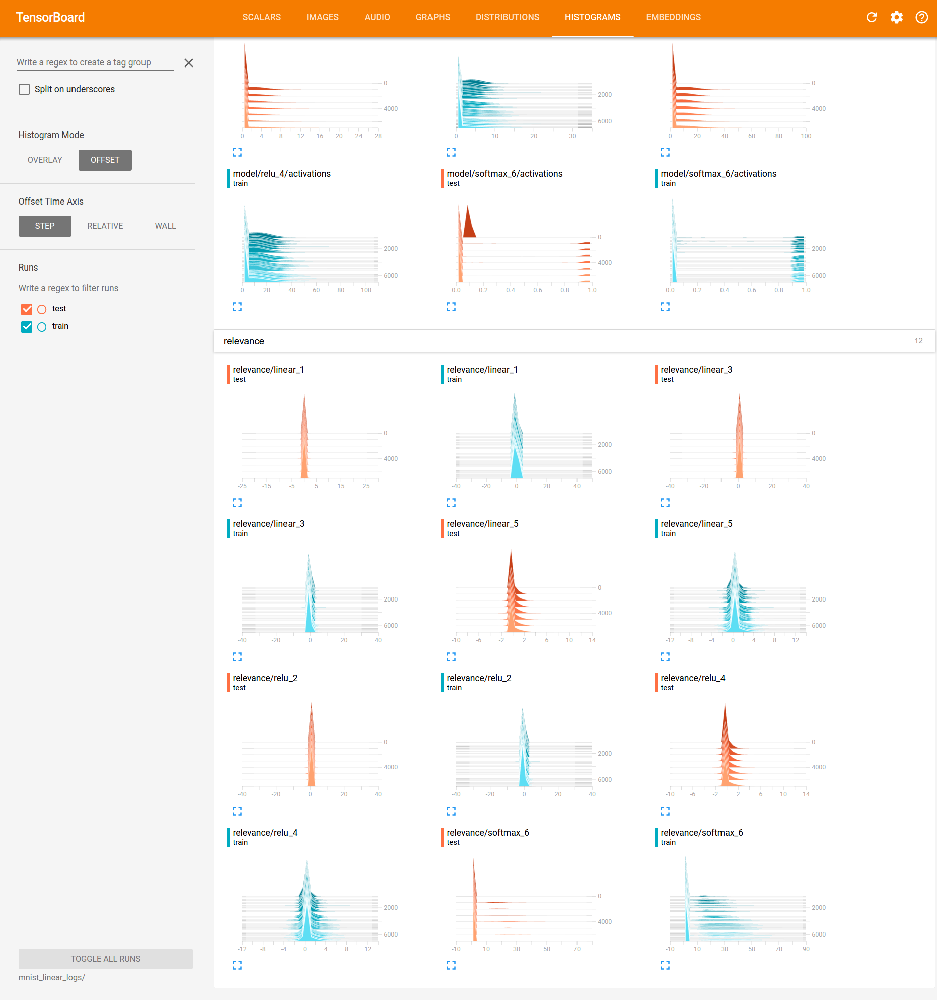
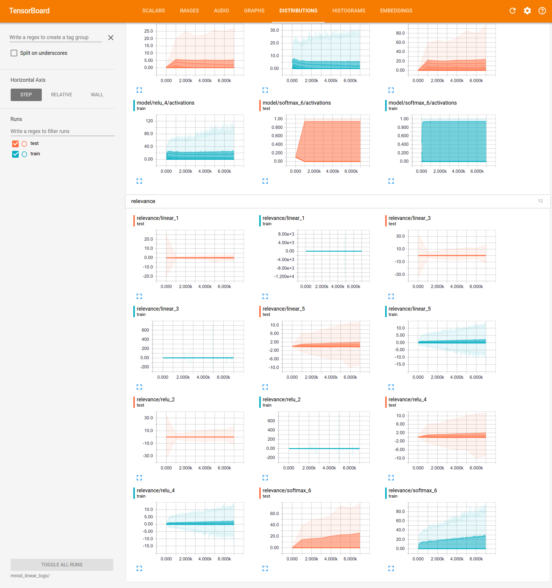

This is a tensorflow wrapper which provides simple and accessible stand-alone implementations of LRP for artificial neural networks.

### Requirements
    tensorflow >= 1.0.0alpha
    python == 2.7
    matplotlib >= 1.3.1
    scikit-image > 0.11.3
    
# Features

## 1. Model 

This TF-wrapper considers the layers in the neural network to be in the form of a Sequence. A quick way to define a network would be

        net = Sequential([Linear(784,500, input_shape=(FLAGS.batch_size,784)), 
                     Relu(),
                     Linear(500, 100), 
                     Relu(),
                     Linear(100, 10), 
                     Softmax()])

        output = net.forward(input_data)
             
## 2. Train the network

This `net` can then be used to propogate and optimize using

        train = net.fit(output, ground_truth, loss, optimizer)

## 3. LRP - Layer-wise relevance propagation

And compute the contributions of the input pixels towards the decision by

        relevance = net.lrp(output, 'simple', 1.0)

the different lrp variants available are:

        'simple'and 'epsilon'
        To-do: 'flat','w^2' and 'alphabeta' 

## 4. Compute relevances every layer backwards from the output to the input  

Follow steps (1) from Features mentioned above.

       relevance_layerwise = []
       R = output
       for layer in net.modules[::-1]:
           R = net.lrp_layerwise(layer, R, 'simple')
           relevance_layerwise.append(R)
           
# Examples 

To run the given mnist examples,
   
        cd examples
        python mnist_linear.py --relevance_bool=True

It downloads and extract the mnist datset, runs it on a neural netowrk and plots the relevances once the network is optimized. The relvances of the images can be viewed using
   
        tensorboard --logdir=mnist_linear_logs

# LRP for a pretrained model

Follow steps (1) and (3) from Features mentioned above.

   
